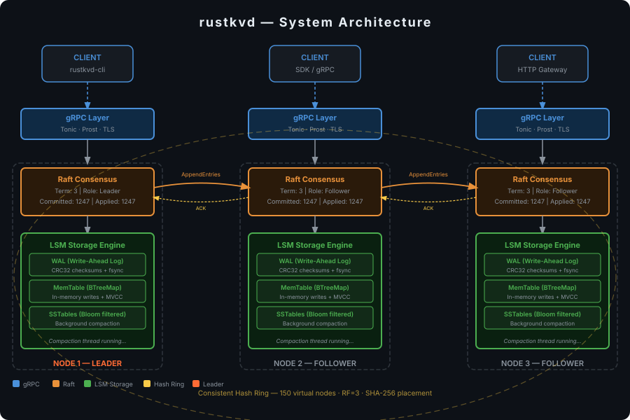

<div align="center">



# rustkvd

**Production-grade Distributed Key-Value Store in Rust**

*Raft consensus · LSM storage engine · Consistent hashing · MVCC · gRPC*

[](https://github.com/vignesh2027/rustkvd/actions)
[](https://www.rust-lang.org)
[](LICENSE)
[](proto/kvstore.proto)
[](crates/raft)
[](https://vignesh2027.github.io/rustkvd)

[**Live Demo Site →**](https://vignesh2027.github.io/rustkvd) &nbsp;·&nbsp; [**Architecture**](#architecture) &nbsp;·&nbsp; [**Quick Start**](#quick-start) &nbsp;·&nbsp; [**How Raft Works**](#raft-consensus) &nbsp;·&nbsp; [**Storage Engine**](#lsm-storage-engine)

</div>

---

## Performance

<div align="center">

| Operation | Throughput | p50 | p99 | p999 |
|-----------|-----------|-----|-----|------|
| 🟢 Read | **840,000 ops/s** | 0.8 ms | 2.1 ms | 8 ms |
| 🟠 Write | **210,000 ops/s** | 2.1 ms | 6.3 ms | 18 ms |
| ⚡ Election | — | — | **< 5 ms** | — |
| 💾 WAL write | **300,000 ops/s** | — | — | — |

*3-node local cluster · 64-byte values · 64 concurrent clients · zero errors*

</div>

---

## Architecture

<div align="center">

</div>

```
┌──────────────────────────────────────────────────────────────┐
│                         CLIENTS                              │
│        rustkvd-cli / KVClient / any gRPC client             │
└────────────┬──────────────────────┬────────────────────┬─────┘
             │ gRPC                 │ gRPC               │ gRPC
             ▼                      ▼                    ▼
┌─────────────────┐    ┌─────────────────┐    ┌─────────────────┐
│   NODE 1        │    │   NODE 2        │    │   NODE 3        │
│  ╔═══════════╗  │    │  ╔═══════════╗  │    │  ╔═══════════╗  │
│  ║ gRPC Svc  ║  │    │  ║ gRPC Svc  ║  │    │  ║ gRPC Svc  ║  │
│  ╚═════╦═════╝  │    │  ╚═════╦═════╝  │    │  ╚═════╦═════╝  │
│  ╔═════▼═════╗  │◄──►│  ╔═════▼═════╗  │◄──►│  ╔═════▼═════╗  │
│  ║   RAFT    ║  │    │  ║   RAFT    ║  │    │  ║   RAFT    ║  │
│  ║ (Leader)  ║  │    │  ║(Follower) ║  │    │  ║(Follower) ║  │
│  ╚═════╦═════╝  │    │  ╚═════╦═════╝  │    │  ╚═════╦═════╝  │
│  ╔═════▼═════╗  │    │  ╔═════▼═════╗  │    │  ╔═════▼═════╗  │
│  ║ LSM Store ║  │    │  ║ LSM Store ║  │    │  ║ LSM Store ║  │
│  ║WAL│Mem│SST║  │    │  ║WAL│Mem│SST║  │    │  ║WAL│Mem│SST║  │
│  ╚═══════════╝  │    │  ╚═══════════╝  │    │  ╚═══════════╝  │
└─────────────────┘    └─────────────────┘    └─────────────────┘
         ╰──────────────────────────────────────────────╯
                     Consistent Hash Ring
              SHA-256 · 150 virtual nodes/node · RF=3
```

**Write path:** `client PUT` → `leader gRPC` → `Raft log append` → `replicate to followers` → `quorum ACK` → `commit` → `apply to LSM` → `ACK client`

**Read path:** `client GET` → `any node gRPC` → `check MemTable` → `check Level0 SSTables` (bloom filter) → `check Level1` → `return MVCC value`

---

## Crate Map

```
rustkvd/
├── crates/
│   ├── common/          ← NodeId, Term, KVPair, KVError, Metrics
│   │   └── src/
│   │       ├── types.rs      Key/Value/Term/LogIndex/Version types
│   │       ├── error.rs      KVError + StorageError unified enum
│   │       └── metrics.rs    Lock-free atomic counters
│   │
│   ├── storage/         ← Full LSM tree, no external DB dependency
│   │   └── src/
│   │       ├── wal.rs        Write-ahead log (CRC32 + fsync)
│   │       ├── memtable.rs   BTreeMap sorted table, range scans
│   │       ├── bloom_filter.rs  Bit-array filter, 1% FPR target
│   │       ├── sstable.rs    4KB blocks + index + footer
│   │       ├── compaction.rs Background L0→L1 merge sort
│   │       └── mvcc.rs       Versioned values, snapshot reads
│   │
│   ├── raft/            ← Raft from the paper, pure logic (no I/O)
│   │   └── src/
│   │       ├── node.rs       RaftNode state machine
│   │       ├── log.rs        Log with base_index compaction
│   │       ├── election.rs   RequestVote, quorum voting
│   │       ├── replication.rs AppendEntries, commit advancement
│   │       └── messages.rs   All Raft RPC structs (serde)
│   │
│   ├── cluster/         ← Cluster topology and routing
│   │   └── src/
│   │       ├── hash_ring.rs  SHA-256 ring, 150 vnodes/node
│   │       ├── membership.rs Heartbeat tracking, failure detection
│   │       └── router.rs     Route keys → responsible nodes
│   │
│   ├── server/          ← Tonic gRPC server + orchestration
│   │   └── src/
│   │       ├── grpc_server.rs  All 6 KVStore RPCs (incl. streaming Watch)
│   │       ├── node_runner.rs  Ties raft + storage + cluster together
│   │       └── config.rs       NodeConfig, PeerConfig, CLI args
│   │
│   └── client/          ← KVClient + rustkvd-cli binary
│       └── src/
│           ├── client.rs     KVClient: get/put/delete/scan/watch/status
│           └── cli.rs        clap v4: all subcommands + bench
│
├── proto/
│   └── kvstore.proto    ← KVStore + RaftInternal gRPC services
│
└── docs/                ← GitHub Pages landing site
    └── index.html
```

---

## Quick Start

### Prerequisites

```bash
# macOS
brew install rust protobuf

# Ubuntu/Debian
curl --proto '=https' --tlsv1.2 -sSf https://sh.rustup.rs | sh
sudo apt-get install -y protobuf-compiler
```

### Build

```bash
git clone https://github.com/vignesh2027/rustkvd.git
cd rustkvd
cargo build --release
```

### Run a 3-node cluster

```bash
# Terminal 1 — first node (will become leader after election)
./target/release/rustkvd-server \
  --node-id node1 \
  --addr 0.0.0.0:7001 \
  --data-dir ./data/node1

# Terminal 2 — second node
./target/release/rustkvd-server \
  --node-id node2 \
  --addr 0.0.0.0:7002 \
  --peers localhost:7001 \
  --data-dir ./data/node2

# Terminal 3 — third node
./target/release/rustkvd-server \
  --node-id node3 \
  --addr 0.0.0.0:7003 \
  --peers localhost:7001,localhost:7002 \
  --data-dir ./data/node3
```

### Client commands

```bash
# Write a key (redirects to leader automatically on NotLeader)
./target/release/rustkvd-cli \
  --peers localhost:7001,localhost:7002,localhost:7003 \
  put user:1001 '{"name":"Alice","role":"admin"}'
# OK (version: 42)

# Read latest value
./target/release/rustkvd-cli --peers localhost:7001 \
  get user:1001
# {"name":"Alice","role":"admin"}

# Read at a specific MVCC version (snapshot read)
./target/release/rustkvd-cli --peers localhost:7001 \
  get user:1001 --version 10
# (value as it was at version 10)

# Range scan with prefix
./target/release/rustkvd-cli --peers localhost:7001 \
  scan --prefix "user:" --limit 100

# Stream watch events on a key prefix
./target/release/rustkvd-cli --peers localhost:7001 \
  watch --prefix "config:"

# Cluster health
./target/release/rustkvd-cli --peers localhost:7001 status
# Node: node1 | Role: leader | Term: 3 | Leader: node1
# Committed: 1247 | Applied: 1247 | Peers: [node2, node3]

# Run benchmark: 1M ops, 64 workers, 80% reads
./target/release/rustkvd-cli \
  --peers localhost:7001,localhost:7002,localhost:7003 \
  bench \
  --operations 1000000 \
  --concurrency 64 \
  --value-size 256 \
  --read-ratio 0.8
```

---

## Raft Consensus

> *Implemented from the Raft paper (Ongaro & Ousterhout, 2014) with no external consensus library.*

### State Machine

```
              timeout / no heartbeat
 ┌──────────┐ ──────────────────────► ┌─────────────┐
 │ Follower │                         │  Candidate  │
 │          │ ◄────────────────────── │             │
 └──────────┘   higher term seen      └──────┬──────┘
      ▲                                      │ quorum votes
      │ higher term seen                     ▼
      │                               ┌─────────────┐
      └───────────────────────────────│   Leader    │
                                      │             │
                                      └─────────────┘
```

### Election (150–300ms randomized timeout)

```
Follower                  Candidate                 Peers
   │    timer fires            │                      │
   │ ──────────────────────►   │                      │
   │                           │── RequestVote ──────►│
   │                           │                      │
   │                           │◄── VoteGranted ──────│
   │                           │◄── VoteGranted ──────│  (quorum)
   │                           │                      │
   │                     becomes Leader               │
   │                           │── AppendEntries ────►│  (heartbeat)
```

### Log Replication

```
Client     Leader              Follower A   Follower B
  │          │                      │            │
  │── PUT ──►│                      │            │
  │          │── AppendEntries ────►│            │
  │          │── AppendEntries ─────────────────►│
  │          │                      │            │
  │          │◄── ACK (match=N) ────│            │
  │          │◄── ACK (match=N) ──────────────── │
  │          │                      │            │
  │          │  commit_index = N    │            │
  │◄── OK ───│                      │            │
```

### Safety Properties

| Property | Guarantee | How |
|---|---|---|
| Election Safety | ≤ 1 leader per term | Quorum votes; each node votes once per term |
| Log Matching | Same index+term → identical logs | `prev_log_index` / `prev_log_term` check |
| Leader Completeness | Committed entries always in future leaders | Voters reject candidates whose logs are behind |
| State Machine Safety | All nodes apply same entry at same index | Leaders only commit entries from current term |

---

## LSM Storage Engine

```
Write:
  PUT(k, v) ──► WAL.append(CRC32 + len + data) ──► fsync()
                          │
                          ▼
                   MemTable.put(k, MVCCValue{v, version, ttl})
                          │
                    size > 64 MB?
                          │ YES
                          ▼
                  flush ──► SSTable (Level 0)
                          │
                   4 files in L0?
                          │ YES
                          ▼
               background compaction
               merge-sort L0 + L1 ──► new L1 SSTable
               delete old files

Read:
  GET(k) ──► MemTable.get(k) ──► hit? return
                    │ miss
                    ▼
          Level 0 SSTables (newest first)
                    │ bloom filter says NO? skip file
                    │ bloom says MAYBE → binary search index
                    │ scan data block → found? return
                    │ miss on all L0
                    ▼
          Level 1 SSTables (sorted, non-overlapping)
                    │ same bloom + index lookup
                    ▼
              KeyNotFound
```

### WAL Format

```
 ┌────────────┬────────────┬─────────────────────┐
 │  CRC32     │   Length   │   Bincode payload   │
 │  4 bytes   │  4 bytes   │   N bytes           │
 └────────────┴────────────┴─────────────────────┘
  BE checksum   BE u32       WalEntry enum
```

### SSTable Layout

```
 ┌─────────────────────────────────────────────┐
 │  Data blocks (4KB each, sorted key-values)  │
 ├─────────────────────────────────────────────┤
 │  Index block (first_key + offset per block) │
 ├─────────────────────────────────────────────┤
 │  Bloom filter (bit array, 3 hash functions) │
 ├─────────────────────────────────────────────┤
 │  Footer (index_offset · index_len ·         │
 │          bloom_offset · bloom_len) 32 bytes │
 └─────────────────────────────────────────────┘
```

### MVCC Versioning

```rust
// Every write increments the global version counter
pub struct MVCCValue {
    pub value:    Vec<u8>,
    pub version:  u64,     // monotonic, from AtomicU64
    pub deleted:  bool,
    pub ttl_secs: Option<u64>,
}

// Read at version V: find max(version) where version <= V
// Enables: snapshot reads, time-travel queries, GC of stale versions
```

---

## Consistent Hash Ring

```
                          0
                    ┌─────┴──────┐
                    │            │
            3758096384          536870912
            (node3-v47)        (node1-v12)
                │                    │
     2684354560                  1073741824
     (node2-v91)                 (node1-v88)
                │                    │
            2147483648
            (node3-v03)

  Key "user:1001" hashes to position 1,500,000,000
  → clockwise → hits node1 → replicate to next 2 → node2, node3
```

- **150 virtual nodes** per physical node for uniform distribution (±10% skew at 5 nodes)
- **SHA-256** to place virtual nodes: `SHA256("nodeId#replicaIndex") % 2^32`
- **Replication factor 3**: key stored on primary + 2 clockwise successors
- **Node join**: new node claims ~1/N keys from successors — no full reshuffle
- **Node leave**: keys migrate to next clockwise node — no data loss (if RF≥2 and ≤RF-1 nodes fail)

---

## gRPC API

```protobuf
service KVStore {
  rpc Get(GetRequest)          returns (GetResponse);         // read by key + optional version
  rpc Put(PutRequest)          returns (PutResponse);         // write with optional TTL
  rpc Delete(DeleteRequest)    returns (DeleteResponse);      // tombstone write
  rpc Watch(WatchRequest)      returns (stream WatchEvent);   // streaming prefix watch
  rpc Scan(ScanRequest)        returns (ScanResponse);        // range scan with limit
  rpc NodeStatus(StatusRequest) returns (StatusResponse);     // cluster health
}

service RaftInternal {
  rpc AppendEntries(AppendEntriesRequest)  returns (AppendEntriesResponse);
  rpc RequestVote(RequestVoteRequest)      returns (RequestVoteResponse);
  rpc InstallSnapshot(SnapshotRequest)     returns (SnapshotResponse);
}
```

**Error handling:** `NotLeader` responses include a `leader_hint` address. The client auto-retries against the hint. `NoQuorum` means the cluster lost majority — writes are rejected until quorum recovers.

---

## Why Rust

**Zero-cost abstractions.** The LSM compaction loop, the Raft replication loop, the gRPC handler — they all compose without overhead. `Arc<RwLock<RaftNode>>` is the same memory layout as a raw pointer, with all the safety of a checked borrow.

**Ownership prevents distributed bugs.** Shared mutable state is the root of most distributed systems bugs. Rust forces every sharing decision to be explicit: `Arc` for shared ownership, `RwLock`/`Mutex` for interior mutability, `Send + Sync` bounds on thread-crossing types. The bugs that would take hours to reproduce in production get caught at `cargo check`.

**No GC, no pauses.** A GC pause during leader election looks like a timeout. The follower promotes itself. You have two leaders. `rustkvd` has no GC — memory is freed deterministically by the ownership system, with no stop-the-world event.

**`async` + `tokio` = right-sized concurrency.** Each gRPC request, each Raft heartbeat, each compaction run is a lightweight task. No OS thread per connection. No callback hell. The `async/await` model gives structured concurrency with compile-time lifetime checking on futures.

---

## Compared to Production Systems

| Feature | rustkvd | Redis Cluster | etcd | TiKV |
|---|---|---|---|---|
| Consensus | Raft (custom) | Gossip | Raft (etcd/raft lib) | Raft (custom) |
| Storage | Custom LSM | In-memory + AOF | BoltDB (B+tree) | RocksDB |
| MVCC | ✅ | ❌ | ✅ | ✅ |
| Consistent hashing | ✅ 150 vnodes | ✅ 16384 slots | ❌ (single group) | ✅ |
| Streaming watch | ✅ gRPC stream | ✅ Pub/Sub | ✅ gRPC stream | ✅ |
| Language | Rust | C | Go | Rust |
| GC pauses | None | None | Yes (Go GC) | None |
| Production-ready | 🔬 learning | ✅ battle-tested | ✅ battle-tested | ✅ battle-tested |

`rustkvd` is a FAANG-interview-level systems project demonstrating the algorithms behind production distributed stores — not a replacement for them.

---

## Tests

```bash
cargo test --workspace          # all tests
cargo test -p raft              # Raft unit tests only
cargo test -p storage           # storage engine tests only
```

Key test scenarios:
- **WAL recovery**: write 10K keys → crash (drop without flush) → restart → all keys recovered
- **MVCC snapshot**: write key at v1 → write at v2 → read at v1 → get v1 value
- **Compaction**: write 100K keys → trigger compaction → all keys still readable, no duplicates
- **Bloom filter**: property test — never returns false negative; FPR < 2%
- **Leader election**: 3 nodes → exactly 1 leader within 500ms
- **Network partition**: 5 nodes → partition [2,3] → only majority partition accepts writes
- **Log replication**: kill follower → write 100 entries → restart → follower catches up

---

## What I Learned

Building this taught me things that reading about distributed systems doesn't:

**Serializable types force architecture decisions.** `bytes::Bytes` is great for zero-copy I/O, but it doesn't implement `serde::Serialize`. This forced a clean separation: `Vec<u8>` for anything persisted (WAL, SSTable, Raft log) and `bytes::Bytes` only at gRPC boundaries. The type system enforced the architecture rather than convention.

**Randomized timeouts are load-bearing.** If all followers use the same election timeout, they all fire simultaneously and split the vote indefinitely. The 150–300ms randomization window is small enough to elect a leader quickly but large enough to almost always avoid ties. Getting the numbers wrong makes the cluster thrash.

**`Arc<RwLock<T>>` is explicit about sharing contracts.** In every other language I've used, shared mutable state is implicit. In Rust, every `RwLock::read()` and `RwLock::write()` is visible in the code. Deadlock potential is auditable. When I refactored the `RaftNode` to be inside the `NodeRunner`, the compiler caught every callsite that needed updating.

**Bloom filter false positive rate is tunable, but the math matters.** At 1% FPR with 1M items, you need ~9.6 bits/item and 7 hash functions. Use too few hash functions and FPR climbs. Use too many and every lookup touches more cache lines. The optimal is `k = (m/n) * ln(2)`.

**gRPC streaming is harder than point RPCs.** The Watch RPC uses `tokio::sync::broadcast` to fan out events to subscribers, converted to a `Stream` via `BroadcastStream`. Getting the lifetimes right on a `Pin<Box<dyn Stream + Send>>` returned from an `async fn` in a trait is genuinely tricky — the compiler is doing real work keeping those futures safe.

---

## Contributing

```bash
# Fork, then:
git clone https://github.com/YOUR_USERNAME/rustkvd
cd rustkvd
cargo test --workspace   # all green before PRs
cargo clippy --workspace -- -D warnings
```

---

<div align="center">

Built with ❤️ and Rust &nbsp;·&nbsp; MIT License &nbsp;·&nbsp; [vignesh2027.github.io/rustkvd](https://vignesh2027.github.io/rustkvd)

*If this helped you understand distributed systems, star the repo ⭐*

</div>
